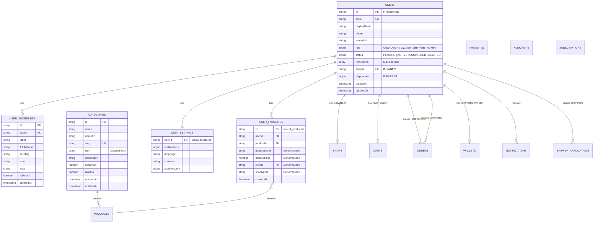

# ER Diagram - KTX Delivery

> **Updated:** 2026-01-07 (AUTH, USER, ADMIN collections)



---

## 📊 Collection Details (AUTH, USER, ADMIN)

### USERS Collection

```typescript
interface User {
  id: string;              // = Firebase Auth UID
  email: string;
  displayName: string;
  phone?: string;
  avatarUrl?: string;
  role: 'CUSTOMER' | 'OWNER' | 'SHIPPER' | 'ADMIN';
  status: 'PENDING' | 'ACTIVE' | 'SUSPENDED' | 'DELETED';
  fcmTokens: string[];     // Max 5 tokens
  shopId?: string;         // If role = OWNER
  shipperInfo?: {          // If role = SHIPPER
    shopId: string;
    status: 'PENDING_APPROVAL' | 'ACTIVE' | 'RESIGNED';
    isOnline: boolean;
    currentOrders: string[];
    maxConcurrentOrders: number;
    totalDeliveries: number;
    rating: number;
    joinedShopAt: Timestamp;
  };
  createdAt: Timestamp;
  updatedAt: Timestamp;
}
```

### USER_ADDRESSES (Embedded or Subcollection)

```typescript
interface Address {
  id: string;
  label: string;           // "Phòng mình", "Tòa B"
  fullAddress: string;
  building?: string;
  room?: string;
  note?: string;
  isDefault: boolean;
  createdAt: Timestamp;
}
```

### USER_FAVORITES Collection

```typescript
// Document ID = {userId}_{productId}
interface UserFavorite {
  id: string;
  userId: string;
  productId: string;
  // Denormalized data for fast display
  productName: string;
  productPrice: number;
  productImage?: string;
  shopId: string;
  shopName: string;
  createdAt: Timestamp;
}
```

### CATEGORIES Collection (Admin-managed)

```typescript
interface Category {
  id: string;
  name: string;            // "Đồ ăn"
  nameEn?: string;         // "Food"
  slug: string;            // "do-an"
  icon?: string;           // Material icon name
  description?: string;
  sortOrder: number;
  isActive: boolean;
  createdAt: Timestamp;
  updatedAt: Timestamp;
}
```

---

## 🔑 Indexes (AUTH, USER, ADMIN)

```javascript
// users
users: email ASC (unique)
users: role, status

// userFavorites
userFavorites: userId, createdAt DESC

// categories
categories: isActive, sortOrder ASC
categories: slug ASC (unique)
```

---

## Legend

| Status | Meaning                |
| ------ | ---------------------- |
| ✅     | Đã implement           |
| 🚧     | Đang implement         |
| 🔲     | Chưa implement         |

---

## Implementation Progress

| Collection           | Backend | Owner  |
| -------------------- | ------- | ------ |
| USERS                | ✅ Done | Hòa    |
| USER_ADDRESSES       | 🔲      | Hiệp   |
| USER_FAVORITES       | 🔲      | Hiệp   |
| USER_SETTINGS        | 🔲      | Hiệp   |
| CATEGORIES           | 🔲      | Hòa    |
| SHOPS                | 🔲      | Ninh   |
| PRODUCTS             | 🔲      | Ninh   |
| CARTS                | 🔲      | Hiệp   |
| ORDERS               | 🔲      | Hòa    |
| PAYMENTS             | 🔲      | Hòa    |
| VOUCHERS             | 🔲      | Hòa    |
| WALLETS              | 🔲      | Hòa    |
| NOTIFICATIONS        | 🔲      | Hiệp   |
| SUBSCRIPTIONS        | 🔲      | Hòa    |
| SHIPPER_APPLICATIONS | 🔲      | Ninh   |
